# Konsil — an adversarial AI medical case-review board for Claude Code

<p align="center">
  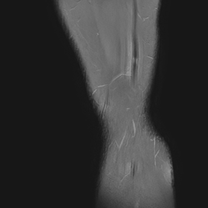
  &nbsp;&nbsp;
  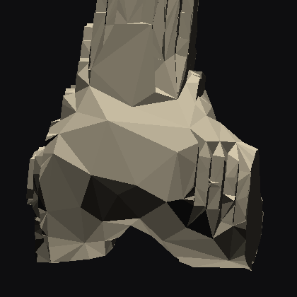
</p>
<p align="center">
  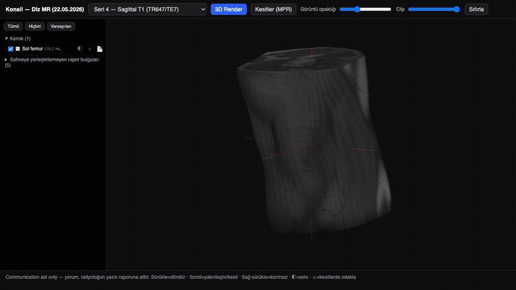
</p>
<p align="center"><sub><em>All animations were produced by Konsil's <strong>deterministic</strong> imaging pipeline from the author's own anonymized knee MRI (shared with consent): top left — windowed slice cine from raw DICOM; top right — 3D bone surface segmented by TotalSegmentator and meshed with marching cubes; bottom — the shipped viewer slice-focusing a structure (⌖): crosshair at its centroid, segmentation mask over the MPR panes, and the radiologist's <strong>written</strong> finding quoted beside it. <strong>No AI model interpreted a single pixel to make these.</strong></em></sub></p>

<p align="center">
  <a href="LICENSE"></a>
  
  
  
</p>

> **⚠️ What this is not.** Konsil is **not a medical device, not a diagnostic tool, and not medical advice**. It produces *preparation and second-opinion material to review with a qualified clinician*. It must never be used in emergencies. Every design decision below exists to keep those statements true. See [Safety & regulatory posture](#safety--regulatory-posture).

**Konsil** (Turkish medical vernacular for a multi-physician case conference) convenes a board of **independent AI specialist agents** over a patient's documented case — history, lab values, and the radiologist's **written** reports — and produces **dissent-preserving, citation-verified board minutes**. It is packaged as a Claude Code plugin: commands, skills, and agent charters, all plain Markdown you can read and change.

It is built around one uncomfortable, well-replicated fact: *panels of agreeing experts and confident single answers are exactly how both humans and LLMs fail in medicine.* Konsil's answer is structural — blind rounds, a professional devil's advocate, a can't-miss auditor, a cost steward, a dissent ledger, and a four-auditor release gate.

---

## Table of contents

- [Why it exists (the evidence behind the design)](#why-it-exists-the-evidence-behind-the-design)
- [What it does / what it refuses to do](#what-it-does--what-it-refuses-to-do)
- [Measured results](#measured-results)
- [Architecture](#architecture)
  - [The board pipeline](#the-board-pipeline)
  - [The roster](#the-roster)
  - [Evidence rules: a citation must be earned](#evidence-rules-a-citation-must-be-earned)
  - [The deterministic imaging pipeline](#the-deterministic-imaging-pipeline)
  - [The Reviewer Gate](#the-reviewer-gate)
- [Installation](#installation)
- [Commands & usage](#commands--usage)
- [Case workspace anatomy](#case-workspace-anatomy)
- [Templates](#templates)
- [Extending Konsil](#extending-konsil)
- [Literature & data APIs used](#literature--data-apis-used)
- [Safety & regulatory posture](#safety--regulatory-posture)
- [Known limitations (measured, not hypothetical)](#known-limitations-measured-not-hypothetical)
- [Roadmap](#roadmap)
- [Repository layout](#repository-layout)
- [License & attributions](#license--attributions)

---

## Why it exists (the evidence behind the design)

Each core mechanism answers a documented failure mode. This is the part of the README you should read even if you skip everything else.

| Design mechanism | Failure mode it answers | Evidence base |
|---|---|---|
| **Blind Round 1** — each specialist works in an isolated context, unaware the others exist | Multi-agent "debate" often *underperforms* a single strong model via sycophantic consensus collapse; role-prompted specialists from one context are one model in costume | Multi-agent medical benchmark literature (e.g., MedAgentsBench; NeurIPS 2025 multi-agent evaluations) |
| **Challenger** (devil's advocate), **Checklist Officer** (can't-miss audit), **Steward** (cost/sequencing) as *fixed structured roles* | What demonstrably adds value is orchestration + tools + structured adversarial roles — not free-form agent discussion | Tool-using / guideline-anchored agent studies vs. debate studies |
| **Dissent Ledger** — disagreements recorded verbatim, never smoothed | A confident singular verdict is the most automation-bias-inducing format possible: wrong AI advice measurably drags human experts' accuracy down | Radiology automation-bias experiments (Radiology, 2023) |
| **In-session citation verification** — an unverified citation does not exist | LLM citation fabrication (measured 18–29% in unguarded systems); even good tool-using agents emit ~23% irrelevant citations | Citation-accuracy evaluations |
| **Missing Data Gate** — the board refuses to convene on thin input | Model accuracy collapses on unstructured, self-reported histories (≈95% on clean vignettes → <35% with real user-written input) | Real-world input-quality studies (Nature Medicine 2024; user-relay studies) |
| **Text only; AI never reads pixels** | General VLMs score 8–35% on unselected clinical images with high hallucination rates; adding images to informative text can *reduce* accuracy | Multimodal radiology evaluations 2024–2026, and **our own measurement below** |
| **Reviewer Gate** — four independent auditors before release | Drafting agents smooth disagreement, launder uncertainty markers, and (rarely but really) hallucinate author names | All three caught live in blinded development runs — see below |

Every citation an agent relies on is retrieved and verified inside that agent's own session, and the search logs stay in the run transcripts — so any claim in a board's minutes can be chased back to the query that found it.

## What it does / what it refuses to do

**Does:**
- Builds a structured, source-mapped **case file** from a folder of mixed documents (report PDFs, lab printout photos, discharge summaries, pathology, DICOM discs) — with a timeline table, computed interval changes, LOINC-mapped labs checked against *printed* reference ranges, and **inconsistency flags** (it recomputes what can be recomputed; it has caught real intra-report contradictions).
- Convenes a **blind, adversarial board** with live, verified literature retrieval, and outputs **board minutes**: consensus with per-member confidences, a dissent ledger, a can't-miss audit, a cost-aware staged next-step plan, questions for the treating physician/radiologist, and a missing-data list.
- Maintains **longitudinal cases**: new results re-convene the board in delta mode ("what changed, at what rate, does it alter the prior assessment").
- Converts DICOM discs into **rotatable 3D scenes and slice views** — deterministically (dcm2niix → TotalSegmentator → marching cubes → NiiVue). Structured outputs (structure names, volumes, laterality) may inform the board **as text**.
- Runs a **`--solo` baseline mode** so you can measure whether the board beats a single agent on your own cases.

**Refuses:**
- To let any language/vision model interpret medical image pixels as part of a board's reasoning.
- To output a singular confident verdict ("the diagnosis is X").
- To convene without intake, or to silently drop `[UNSOURCED]` / `[ESTIMATE]` markers.
- To address treatment instructions to a patient. Output is framed to the treating clinician, always.

## Measured results

The numbers below were **measured during development**, not projected.

### The safety machinery, tested against the system itself

In blinded end-to-end development runs, the audit layers repeatedly caught the system's own failures — which is their job:
- The **Reviewer Gate** caught two hallucinated author names (the PMIDs and figures were correct — only the names were invented), one silently-smoothed disagreement that had been dropped from the dissent ledger, and a composite quote mislabeled "verbatim."
- A crashed sub-agent left behind a stale draft claiming verifications that never happened; the retry agent **detected the stale draft and rewrote it**, re-verifying every load-bearing citation itself.
- Most instructive: the Challenger once attacked a specialist consensus with a methodologically sound, evidence-cited argument that happened to point *away* from the truth — and the dissent-preserving design kept the correct position alive on the question list, where the planned confirmatory testing would have recovered it. *A good devil's advocate can be locally wrong while making the plan globally safer.*

### Why the no-pixels rule is architecture, not a disclaimer

In development we also scored experimental AI image observations against an independent radiologist's written report. The pattern matched the published literature exactly: reliable on *negative/normal* statements and on deterministic pipeline outputs, weak at *characterizing* what it saw, and blind to subtle findings. The system's calibration held — every image observation had been labeled unverified and converted into *questions for the radiologist* rather than findings, and the "no AI observation may justify any intervention without an independent report correlate" rule prevented a plausible-looking cascade toward an intervention the report showed to be unwarranted.

## Architecture

### The board pipeline

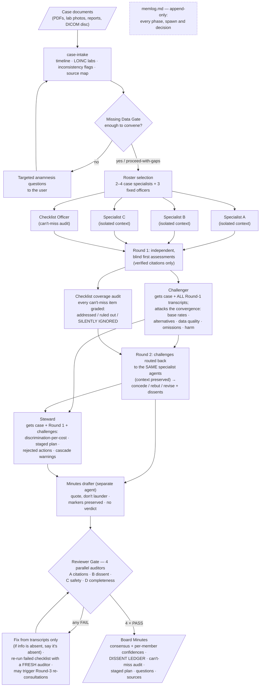

### How the agents actually talk

The flowchart shows phases; this shows the conversation. Specialists are real, separate agent sessions — Round 2 resumes the *same* agents so their context (and accountability) carries over:

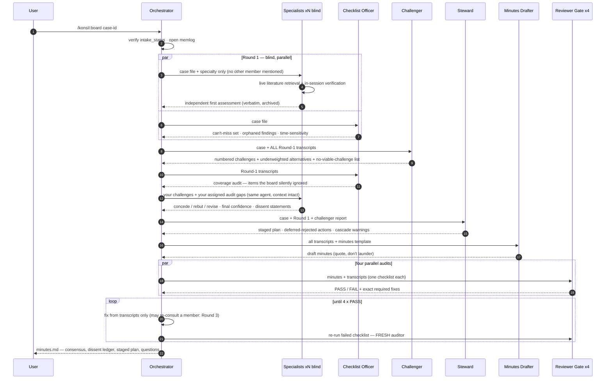

### Case lifecycle

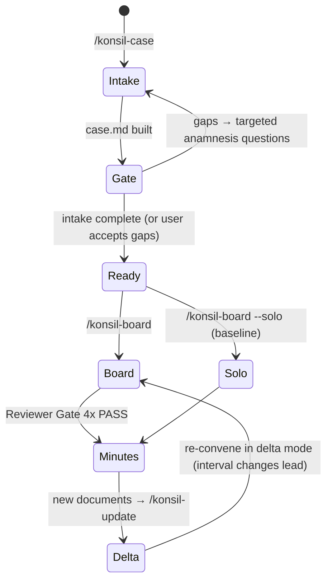

### The roster

Every board seats **2–4 case specialists** (chosen from the problem list: e.g., nephrology, endocrinology, orthopaedics…) plus three **fixed officers** who sit on every board regardless of the case:

| Officer | Charter (one line) | Anti-pattern it kills |
|---|---|---|
| **Challenger** (`agents/challenger.md`) | Steelman the leading hypothesis, then attack it: base rates, underweighted alternatives, single-measurement load-bearing data, omissions, intervention harm. Must declare "no viable challenge" where a position survives — manufactured dissent is prohibited. | Anchoring, premature closure, groupthink |
| **Checklist Officer** (`agents/checklist.md`) | Aviation-checklist audit: build the case's can't-miss set, grade every item *addressed / ruled out with evidence / silently ignored*, hunt **orphaned findings** (abnormalities with no disposition) and time-sensitive items. | The interesting-case bias; silent omissions |
| **Steward** (`agents/steward.md`) | Cheapest, least invasive next test that best discriminates the live differential; staged conditional plan; cascade-risk warnings; "an action whose every outcome leads to the same next step is deferred by definition." | Over-testing, incidentaloma cascades, cost blindness |

Round-1 isolation is real isolation: separate agent contexts, prompts that do not mention other members' existence. And when isolated specialists nevertheless converge, the Challenger's charter demands the obvious skeptical move: convergence under shared sources and shared framing is graded as *one* line of evidence, not three.

### Evidence rules: a citation must be earned

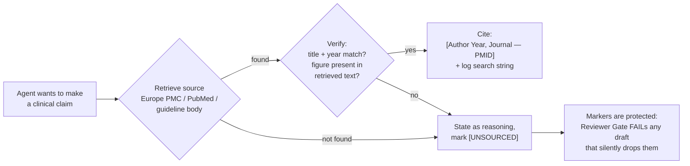

The full protocol — source hierarchy, API cookbook with `curl` one-liners, forbidden sources (and why), failure handling — is `skills/literature-protocol/SKILL.md`. In development gate runs, auditors re-resolved **every cited PMID** and found zero fabricated identifiers or figures — while catching wrong *author names*, which is exactly the failure class the gate exists for.

### The deterministic imaging pipeline

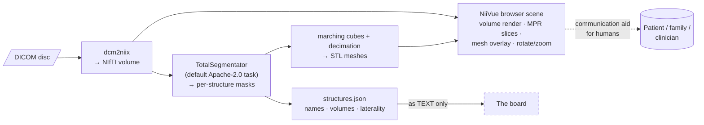

**The hard rule:** the board consumes `structures.json` and written reports — never screenshots, never pixels. The 3D scene exists so a human can *see where the radiologist's written findings live*; interpretation stays with the written report. The hero GIFs at the top of this README are this pipeline's actual output.

#### Viewer gallery — everything the browser scene does

All of the below is the shipped `viewer.html` / pipeline output on the same consented MRI (see hero-image note). Deterministic, local, zero AI on pixels:

| | |
|---|---|
| 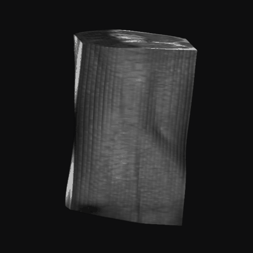 | **3D volume render** — GPU raycast of the raw volume, drag-to-rotate in the browser |
| 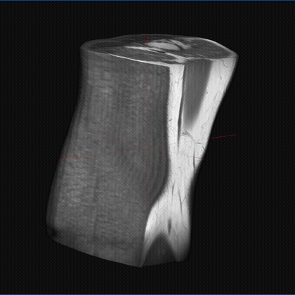 | **Clip plane** — slider cuts into the render to expose interior anatomy |
| 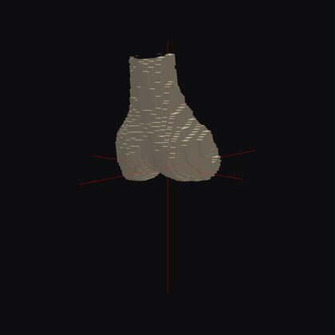 | **Per-structure mesh** — TotalSegmentator's femur mesh rendered on its own (solo ◐); the same output feeds the board structure names, volumes and laterality as *text* |
| 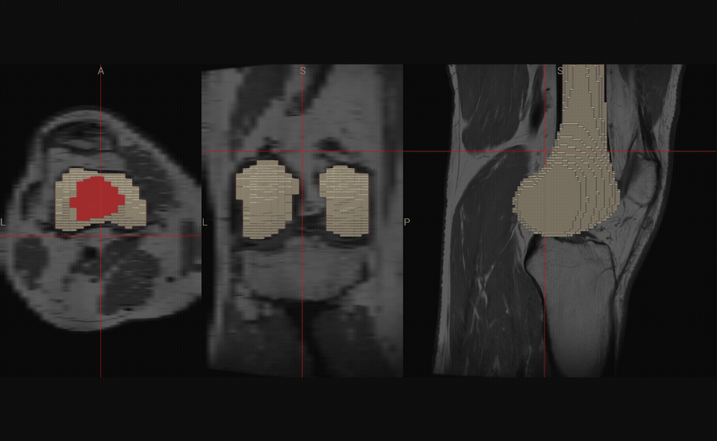 | **MPR (multiplanar) view** — synced sagittal/coronal/axial panes with crosshair; the focused structure's segmentation mask is overlaid on the slices |
| 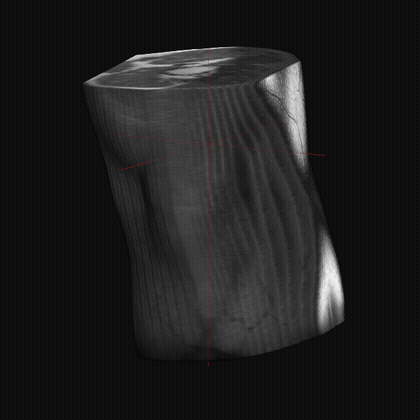 | **Series switcher** — Sagittal T1 / Sagittal PD / Coronal PD-T2 / Axial PD from one DICOM disc |
|  | **Slice-focus + report annotations** — ⌖ jumps the MPR crosshair to the structure's centroid and the sidebar quotes the radiologist's *written* findings for it (`annotations.json`); findings with no segmented structure are listed as "not localizable" |

Every case ships the *same* data-driven viewer (`skills/imaging-3d/assets/viewer.html` + per-case `scene.json`; NiiVue is vendored, so it works offline). The grouped structure panel gives per-organ show/hide, **solo** (◐ — isolate one structure) and **slice-focus** (⌖ — jump the MPR crosshair to that organ's centroid and overlay its segmentation mask on the slices). Structure names, groups and colors are mapped to Turkish deterministically in `scripts/build_scene_viewer.py`.

Runtime on an Apple-Silicon Mac: `--fast` segmentation ≈ 1–3 min per study; full-res 10–45 min. Cost per study: $0.

### The Reviewer Gate

Four independent auditors, spawned in parallel, each with one checklist (`agents/reviewer.md`):

- **A — Citation integrity:** re-resolves every citation; spot-checks load-bearing figures against retrieved abstracts; verifies no `[UNSOURCED]`/`[ESTIMATE]` marker was laundered into fact.
- **B — Dissent integrity:** diffs the minutes against the transcripts; every disagreement must appear in the ledger verbatim; no false consensus, no smoothed paraphrase posing as quotation.
- **C — Safety language:** clinician-directed framing, untouched disclaimer block, no pixel interpretation, time-sensitive items prominent, no singular verdict.
- **D — Completeness & traceability:** every template section filled; every recommendation traceable to a named member and transcript; every abnormal finding in the case file has a disposition.

Any FAIL is fixed **from the transcripts only** and the failed checklist re-runs with a **fresh** auditor — fresh, because in development the dissent auditor once failed the minutes twice in a row, the second time over the *orchestrator's own fix* (it had spliced three quote fragments and labeled the composite "verbatim"). The gate audits the fixer too.

## Installation

Requires [Claude Code](https://claude.com/claude-code).

```bash
# One-liner (straight from GitHub):
claude plugin marketplace add arbade/konsil
claude plugin install konsil@konsil-marketplace -y

# — or from a local clone:
git clone https://github.com/arbade/konsil ~/konsil
claude plugin marketplace add ~/konsil --scope local
claude plugin install konsil@konsil-marketplace -y

# 3. (Optional — only for /konsil:imaging) install the deterministic imaging stack
bash ~/konsil/scripts/setup_imaging.sh
#    installs dcm2niix (brew) + a Python venv with TotalSegmentator, nibabel,
#    scikit-image, trimesh. Model weights (~GBs) download on first segmentation run.
```

New Claude Code sessions pick the plugin up automatically; commands appear under the `/konsil:` namespace.

## Commands & usage

| Command | What happens |
|---|---|
| `/konsil:case <folder or case-id>` | Intake: builds the structured case file from mixed documents, runs plausibility checks and inconsistency flags, then **stops at the Missing Data Gate** with targeted questions. No board convenes from this command. |
| `/konsil:board <case-id> [--solo]` | Convenes the board on a completed case file: blind Round 1 → Challenger cross-examination → Steward → Reviewer-Gated minutes. `--solo` runs a single-agent baseline with identical evidence rules, for A/B comparison. |
| `/konsil:update <case-id> <new docs>` | Longitudinal mode: folds new results into the case, computes interval changes (growth rates, trend slopes), re-convenes in delta mode. The new minutes lead with *what changed*. |
| `/konsil:imaging <case-id> [--fast] [--mr]` | The deterministic DICOM → 3D pipeline + browser viewer. `--mr` selects the MRI segmentation task. |

A typical first session:

```text
> /konsil:case ~/Downloads/moms-documents
  → case file built: 23 dated events, 41 lab rows (2 flagged implausible, confirm?),
    3 inconsistency flags, intake_status: pending
  → 8 targeted questions (answer, or say "proceed with gaps")

> /konsil:board case-001
  → roster: nephrology, endocrinology, internal medicine + Challenger/Checklist/Steward
  → [several minutes of parallel agents doing live literature retrieval]
  → minutes.md: consensus (with confidences), 2 dissent-ledger entries,
    can't-miss audit, staged plan, 11 questions for the treating team
```

Expect a full board run to spawn **10–15 agent sessions** (specialists ×2 rounds, officers, drafter, 4+ gate auditors). It is deliberate overkill — that's the product.

## Case workspace anatomy

```
cases/<case-id>/
├── inbox/                      # your documents, untouched
├── case.md                     # structured case file (template below)
├── scene/                      # deterministic imaging output (if any)
│   ├── nifti/  segmentations/  meshes/
│   ├── structures.json         # names + volumes → board-readable text
│   └── viewer.html             # rotatable browser scene
└── board-<date>/
    ├── memlog.md               # append-only orchestration log
    ├── round1-<member>.md      # verbatim blind assessments
    ├── round2-challenger.md    # the attack
    ├── round2-<member>.md      # concede / rebut / revise
    ├── round2-steward.md       # staged plan
    ├── round3-*.md             # re-consultations (if the gate demands them)
    ├── gate-A..D*.md           # Reviewer Gate audit reports
    └── minutes.md              # the deliverable
```

Everything is Markdown. The transcripts are the audit trail; the minutes may organize them but never replace them.

## Templates

Two templates drive all structured output (both in `templates/`):

**`case-file.md`** — frontmatter carries machine-readable state:

```yaml
---
case_id: ...
language: ...          # board writes minutes in the case's language
intake_status: pending # pending | complete | complete-with-gaps
gaps_accepted: [...]   # every gap the user chose to proceed with
---
```

plus: ranked problem list · **timeline table** (one dated fact per row; corrections are new rows flagged `[CORRECTS <date>]`, never overwrites) · labs with *printed* reference ranges · imaging findings from written reports only · **inconsistency flags** · source map (every fact → its document).

**`board-minutes.md`** — 12 sections + appendix; the ones that make Konsil different:

- **§7 Dissent Ledger** — every unresolved disagreement, both positions verbatim, each side's "what would change my mind." An empty ledger on a complex case is itself flagged as a red flag.
- **§8 Can't-Miss Audit** — coverage grades, orphaned findings, time-sensitive items with safe intervals.
- **§9 Stewardship** — Stage-0 (zero-cost, same-day) → Stage-1 (the single uncontaminated draw/test set) → conditional branches, each expensive step behind an explicit gate; rejected actions listed *with reasons*.
- **§10 Questions for the treating physician / radiologist** — including report inconsistencies to re-measure.
- **§12 Sources** — every citation attributed to the member whose session verified it; `[UNSOURCED]`/`[ESTIMATE]` items listed separately.
- The **disclaimer block is untouchable** — Gate C diffs it byte-for-byte against the template.

## Extending Konsil

**Add a specialist type.** Specialists are generic: the orchestrator passes the specialty in the spawn prompt, so "add pediatric neurology" is a roster decision, not a code change. To give a specialty standing knowledge (e.g., a guideline file), add a persona file under `agents/` following `specialist.md`'s structure and reference it from the orchestrator skill.

**Add an officer.** Copy an officer charter (`challenger.md` is the best template), define: the failure mode it exists to catch, its procedure, its output format, and its evidence obligations. Wire it into `skills/board-orchestrator/SKILL.md` Phase 2/3.

**Change the report.** Edit `templates/board-minutes.md` — then update Gate D's completeness expectations in `agents/reviewer.md` to match. The gate must always chase the template.

**Add a gate.** New auditor checklist in `agents/reviewer.md` (E, F…), then list it in `skills/board-report/SKILL.md`. Gates are cheap; silent failure modes are not.

**Tune evidence sources.** `skills/literature-protocol/SKILL.md` is the single place agents learn where (and where not) to search. Keep the verification step non-negotiable.

## Literature & data APIs used

| API | Use | Auth / limits | Notes |
|---|---|---|---|
| Europe PMC REST | Primary search + open-access full text | none / 10 req·s⁻¹ | The workhorse |
| PubMed E-utilities | Secondary search, record verification | none / 3 req·s⁻¹ (10 with free key) | |
| NLM Clinical Tables | LOINC mapping for lab intake | none | Reference ranges still come from the printed report — they are lab-specific |
| Guideline bodies (EAU, AUA, NICE, USPSTF…) | Guideline anchoring via WebFetch | varies | |
| **Deliberately not used** | Semantic Scholar (restrictive API license), WikEM (ToS prohibits AI use), UpToDate / OpenEvidence (closed) | | Documented in the protocol so agents don't wander into them |

## Safety & regulatory posture

Konsil is built for **personal / educational use** and positions itself, by construction, on the non-device side of the clinical-decision-support line:

1. **Inputs are text**: history, discrete lab values, and the radiologist's *written* findings. Software that analyzes medical image **pixels** and renders findings is a regulated medical device in the US (FDA CADx classifications), EU (MDR Rule 11, Class IIa+), and jurisdictions that mirror the MDR. Konsil's imaging pipeline is deliberately deterministic and non-interpretive.
2. **Outputs are recommendations with reviewable basis** — ranked possibilities with confidences, verified sources, and preserved dissent — addressed to a clinician, never directives to a patient. (US readers: this maps onto the FDA's non-device CDS criteria, including the January 2026 guidance revision that explicitly covers synthesis of a radiologist's written findings. This README is not legal advice.)
3. **Not for time-critical use.** The minutes template says so; Gate C enforces the framing.
4. **If you fork this into something patient-facing or pixel-reading, you are building a medical device.** Plan accordingly, in every jurisdiction you ship to.
5. Model-provider terms apply independently (e.g., usage policies treating medical diagnosis as high-risk requiring qualified professional review). Konsil's clinician-review framing is designed to comply; keep it.

## Known limitations (measured, not hypothetical)

- **AI image reading is unreliable and is therefore excluded from board reasoning.** Published evaluations and our own development scoring agree: acceptable on negatives, weak at characterization, blind to subtle findings. If you enable any experimental image viewing for personal use, every observation must carry the unverified-observation label and converts to *questions*, never findings.
- **No formal benchmark yet.** Blinded end-to-end development runs are encouraging but few, and retrospective published material is always subject to training-data-contamination concerns (file-blinding ≠ memory-blinding). The honest benchmark — board vs. `--solo` single agent on ≥10 blinded retrospective cases with independent evaluators — is designed but not yet run.
- **Cost & latency.** A full board is 10–15 agent sessions with live retrieval. Minutes take tens of minutes, not seconds. `--solo` exists for cheap runs — and for keeping the board honest.
- **Language coverage** is whatever the underlying model handles; the system passes the case language through explicitly (tested: English, Turkish).
- **Segmentation scope.** The default (fully open) TotalSegmentator tasks cover trunk organs and major bones — not menisci, ligaments, or small joints. Specialized subtasks exist under a **non-commercial** license (audit before any commercial redistribution; see below).

## Roadmap

Grounded in the measured gaps, roughly in order:

1. **Kill-test #1:** board vs. `--solo` on ≥10 blinded retrospective published cases, independent blinded evaluators. The result decides whether the multi-agent board earns its cost — the repo ships the instrumentation either way.
2. **Protocol-adequacy gate:** "this study cannot answer this question" detection from DICOM metadata (missing sequences/contrast/FOV) at intake — extends the two categories that measured 100%.
3. **Quantification tools:** user-guided measurement on slices (system measures, never characterizes); automatic per-structure volumetrics into the case file.
4. **Longitudinal difference detector:** rigid registration between serial studies + change reporting — change detection is an easier, more honest problem than characterization.
5. **Targeted closed-question reading experiment** (pre-registered): pipeline-cropped ROIs + narrow yes/no questions vs. the measured free-reading baseline; enters the product only if it clears pre-set thresholds.
6. **Human-in-the-loop second-read integration:** package slices + the board's questions for a real radiologist's paid second read — the only currently honest answer for subtle findings.
7. **Accuracy scorecard automation:** when a written report arrives after AI observations were made, auto-score them so the system accumulates its own honesty data.

## Repository layout

```
konsil/
├── .claude-plugin/          # plugin + marketplace manifests
├── commands/                # /konsil:case | board | update | imaging
├── skills/
│   ├── case-intake/         # intake + Missing Data Gate
│   ├── board-orchestrator/  # roster, blind rounds, cross-exam, phases
│   ├── board-report/        # minutes drafting rules + Reviewer Gate loop
│   ├── literature-protocol/ # evidence rules + API cookbook
│   ├── case-update/         # longitudinal delta mode
│   └── imaging-3d/          # deterministic DICOM → 3D scene
├── agents/                  # specialist, challenger, checklist, steward, reviewer
├── templates/               # case-file.md, board-minutes.md
├── scripts/                 # setup_imaging.sh, dicom_to_scene.py
├── docs/assets/             # README media (from the author's own anonymized MRI)
└── cases/                   # your cases live here (gitignored — always empty upstream)
```

`cases/` is gitignored on purpose: **never commit health data — yours or anyone else's.** Board runs, transcripts, gate reports and minutes all live under `cases/<id>/` and stay local.

## License & attributions

**MIT** — see [LICENSE](LICENSE) (with a non-binding medical-disclaimer addendum).

Standing on the shoulders of:

- **[TotalSegmentator](https://github.com/wasserth/TotalSegmentator)** (code & default task weights: Apache-2.0; several specialized subtasks are **non-commercial** — audit per-task before commercial redistribution)
- **[dcm2niix](https://github.com/rordenlab/dcm2niix)** (BSD-style), **[NiiVue](https://github.com/niivue/niivue)** (BSD-2), **nibabel / scikit-image / trimesh** (BSD/MIT)
- **Europe PMC** and **NCBI E-utilities** for open literature access; **NLM Clinical Tables** for LOINC
- Orchestration patterns informed by **[BMAD-METHOD](https://github.com/bmad-code-org/bmad-method)** (multi-persona subagent party-mode, reviewer-gate document pipelines) and plugin packaging by **[pm-skills](https://github.com/phuryn/pm-skills)**
- Built with **[Claude Code](https://claude.com/claude-code)**; board members are Claude subagents

The hero and gallery GIFs derive from the author's **own** knee MRI (exported from a national teleradiology portal with identifying metadata already stripped), published here with the owner's explicit consent. Do not reuse them for model training or clinical purposes.

---

<p align="center"><sub><strong>Konsil renders opinions with receipts, disagreements included — and the final word always belongs to your physician.</strong></sub></p>
